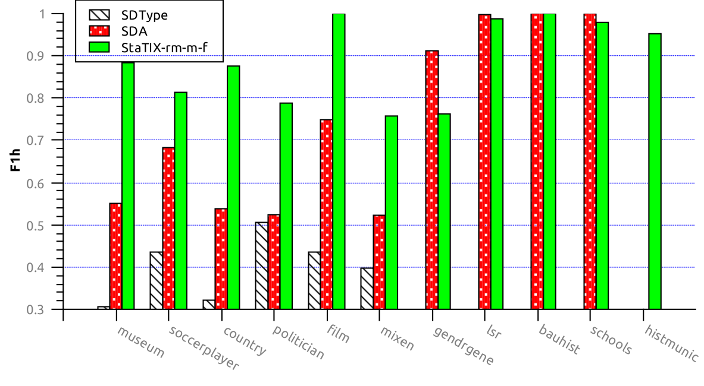
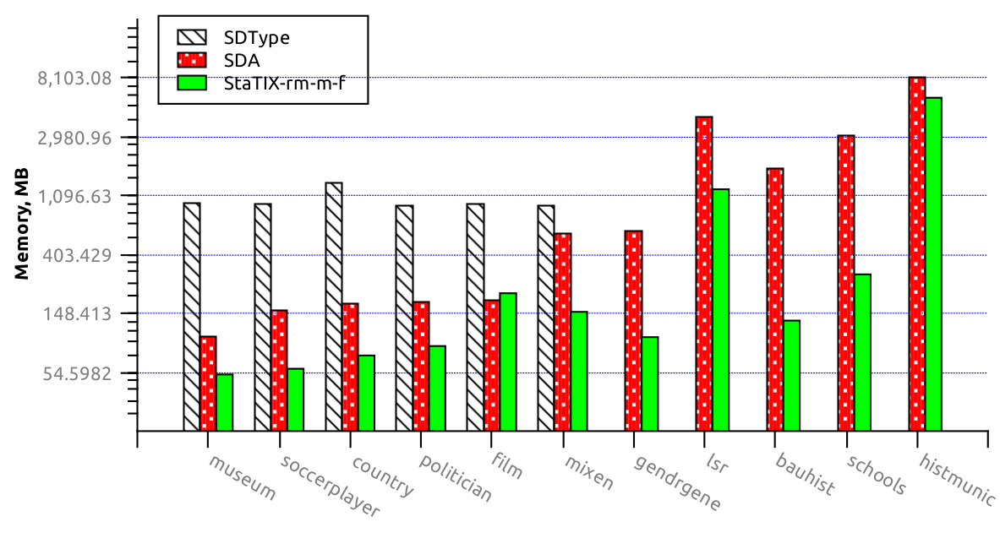

# TInfES
Type Inference Evaluation Scripts &amp; Accessory Apps (used for the StaTIX benchmarking)

\authors: (c) Soheil Roshankish, Artem Lutov <artem@exascale.info>  
\license:  [Apache License, Version 2.0](https://www.apache.org/licenses/LICENSE-2.0)  
\organization: [eXascale Infolab](http://exascale.info/)  
\date: 2017-08

## Content
- [Overview](#overview)
- [Requirements](#requirements)
- [Usage](#usage)
- [Benchmarking Results](#benchmarking-results)
- [Related Projects](#related-projects)

## Overview

Scripts and accessory Java applications used for the type inference benchmarking of [StaTIX](https://github.com/eXascaleInfolab/StaTIX).

### Scripts

- `evalgt.sh`  - executes the evaluation app ([xmeasures](https://github.com/eXascaleInfolab/xmeasures), [gecmi]((https://github.com/eXascaleInfolab/GenConvNMI)), etc) specified number of times with the specified options on each `*.cnl` file in each specified input directory, evaluating against the <inpdir>_gt.cnl ground-truth.
- `shufrdfs.sh`  - shuffles and reduces input RDF dataset in N3 format to the specified ratio.
- `execfile.sh`  - executes commands from the specified file tracing the resource consumption.
- `mkevaldirs.sh`  - creates directories corresponding to the ground-truth files to put evaluating type inference results there.
- `linkfiles.sh`  - links type inference (clustering) results of the algorithm(s) to the corresponding evaluating directories made by `mkevaldirs.sh`.

## Requirements

The scripts require any `POSIX` compatible execution environment (Linux or Unix). Java apps were tested on Java 1.8+.

## Usage

To perform batch execution of the clustering algorithms copy / unpack the required algorithm to the dedicated directory `<algdir>` and link / copy there `scripts/execfile.sh`, `scripts/<algname>.exs`, [exectime](https://bitbucket.org/lumais/exectime/). Update paths in the `<algname>.exs` if required.  
Run the batch execution: `./execfile.sh <algname>.exs`. It produces `evals_<algname>.rcp` containing execution time and memory consumption measurements in the current directory and resulting clusterings (type inference) according to the specified parameters in the `<algname>.exs`.

To perform batch evaluation of the type inference accuracy, create a dedicated directory `<evals>/` and link / copy there `scripts/evalgt.sh`, `scripts/linkfiles.sh`, `scripts/mkevaldirs.sh`, [xmeasures](https://github.com/eXascaleInfolab/xmeasures), [gecmi](https://github.com/eXascaleInfolab/GenConvNMI) and ground-truth files from the `data/<datasets>_gt` (or produce them). The ground-truth files contain for each #type property space separated subject ids, sequentially enumerated from 0. Run `./mkevaldirs.sh` to create directories that will hold type inference results to be evaluated against the respective ground-truth files. Then run `linkfiles.sh <results_dir>` to link algorithm(s) results to the corresponding directories to be evaluated. And finally run the batch evaluations using `evalgt.sh` script. See `evalgt.sh -h` for details. It produces the required evaluations (`eval_<evalapp-params>.txt` files) in the current directory, which are the accuracy results of the type inference.

## Benchmarking Results

All the [benchmarking results](https://docs.google.com/spreadsheets/d/e/2PACX-1vShqU5Vs9GimVV5OXoZ50uFNwhGfySwNZGYFufKo-lyq5-FMDAZ77yYLcFbo_iOGa2kDe5a1bI6TCFj/pubhtml?gid=2147007814&single=true)) are available online and some plots are listed below. [StaTIX](https://github.com/eXascaleInfolab/StaTIX) executed with `-m`, `-f` `-r m` parameters in non-supervised (StaTIX-mr) and semi-supervised (StaTIX-mr_s0.25) modes.

### Accuracy
#### [Harmonic F1-Score](https://github.com/eXascaleInfolab/xmeasures)

Higher is better.
#### [Overlapping NMI](https://github.com/eXascaleInfolab/OvpNMI)

Higher is better.

Higher is better.

### [Efficiency](https://bitbucket.org/lumais/exectime/)
#### Execution Time

Lower is better.
#### Memory Consumption (RAM)

Lower is better.

**Note:** Please, [star this project](//github.com/eXascaleInfolab/TInfES) if you use it.

## Related Projects

- [StaTIX](https://github.com/eXascaleInfolab/StaTIX)  - Statistical Type Inference (both fully automatic and semi supervised) for RDF datasets in N3 format.
- [xmeasures](https://github.com/eXascaleInfolab/xmeasures)  - Extrinsic clustering measures evaluation for the multi-resolution clustering with overlaps (covers): F1_gm for overlapping multi-resolution clusterings with possible unequal node base and standard NMI for non-overlapping clustering on a single resolution.
- [OvpNMI](https://github.com/eXascaleInfolab/OvpNMI) - NMI evaluation method for the overlapping clusters (communities) that is not compatible with the standard NMI value unlike GenConvNMI, but it is much faster than GenConvNMI.
- [GenConvNMI](https://github.com/eXascaleInfolab/GenConvNMI) - Overlapping NMI evaluation that is (unlike `onmi`) compatible with the original NMI and suitable for both overlapping and multi resolution (hierarchical) clusterings.
- [ExecTime](https://bitbucket.org/lumais/exectime/)  - A lightweight resource consumption profiler.
- [PyCABeM](https://github.com/eXascaleInfolab/PyCABeM) - Python Benchmarking Framework for the Clustering Algorithms Evaluation. Uses extrinsic (NMIs) and intrinsic (Q) measures for the clusters quality evaluation considering overlaps (nodes membership by multiple clusters).
